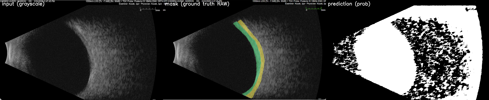

### TESTS : [](https://github.com/vsi-lab/retina_ultrasound_annotation/actions/workflows/ci.yml)


# Retinal Ultrasound Segmentation

This repository implements a segmentation pipeline for **retinal ultrasound (USG)** imaging.  
It focuses on delineating *retinal detachment* and related anatomical layers using modern architectures like **TransUNet** and **U-Net**.  
The project emphasizes:
- High-quality preprocessing and augmentation of clinical ultrasound data,
- Consistent data/model configuration,
- Clinician-readable augmentation previews for validation.

Note : This project is similar to this TVST 2025 study on Automated Detection of Retinal Detachment using Deep Learning-based Segmentation on Ocular Ultrasonography (PMCID: PMC11875030)
https://pmc.ncbi.nlm.nih.gov/articles/PMC11875030/ 

---

## Note on Models to train
- Unet++ : Gold standard baseline for segmentation
- TransUnet : A very strong option here as noted in TVST 2025 study. <--- Gave better results than Unet++
- MedSAM / 2 : 

**Next steps**
- Scale dataset: More patients, more views/clock-hours, more pathology variety
- Add clinically useful classes RD/VH
- Add cropped ROIs: cropping to reduce black background as much possible
- Train with higher-resolution images e.g. 768x768 px
- Experiment Boundary Loss or Surface Loss. 
- Multi task Seg + classification enhancement 
  - encoder + spatial RD gating (F * P_RD) → GAP → MLP
    where GAP -> Global Av Pooling 


### How to get Pretrained TransUnet
```
# as a subfolder
mkdir -p third_party && cd third_party

[//]: # (git clone https://github.com/Beckschen/TransUNet.git transunet)
Or better 
# TransUNet (pinned to a known-good commit)
pip install "git+https://github.com/Beckschen/TransUNet@192e441f2e2979ea289b4f521dd6d07a2d0f1f5f#egg=transunet"

cd ../work_dir
mkdir "vit_checkpoint/imagenet21k"  && cd "vit_checkpoint/imagenet21k"
cd vit_checkpoint/imagenet21k

# Hybrid ResNet50 + ViT-B/16 (TransUNet paper’s common choice)
curl -L  'https://storage.googleapis.com/vit_models/imagenet21k/R50%2BViT-B_16.npz' -o R50+ViT-B_16.npz
```

----
# USFM 

In the first draft, we compare a task-specific model, TransUNet, with a foundation-model baseline, the UltraSound Foundation Model (USFM) UPerNet https://github.com/openmedlab/USFM
FOR USFM colab setup, check the notebooks folder


---


## Project Structure
```
usg_segmentation/
├── .venv/                         # Virtual environment (excluded from version control)
│
├── docs/                          # Documentation and visual outputs
│   └── images/                    # e.g., preview_panel.png, diagrams, etc.
│
├── models/                        # Segmentation model definitions
│   ├── model_factory.py           # Factory to initiate different models, TransUnet, uNet++
│   └── segformer_wrap.py          # Wrapper for segformer model <--- Experimental, not fully integrated
│
├── tests/                         # Unit and integration tests
│   ├─  <other tests>
│
├── training/                      # Segmentation training components
│   ├── augments.py                # Augmentations : Albumentations transforms for training
│   ├── dataset.py                 # Dataset and DataLoader utilities
│   ├── eval_seg.py                # Evaluation metrics and visualization
│   ├── losses.py                  # Dice, focal, and hybrid loss functions
│   ├── metrics.py                 # IoU, Dice coefficient, and confusion matrix metrics
│   └── train_seg.py               # Core segmentation training loop
│
├── utils/                         # Helper scripts for visualization and data prep
│   ├── preview_augs.py            # Augmentation preview panel generator
│   ├── scan_to_csv.py             # Scan image/mask dirs to auto-generate CSV splits
│   ├── usg_transforms.py          # Custom preprocessing & ultrasound-specific transforms
│   └── vis.py                     # Visualization helpers for masks, contours, overlays
│
├── work_dir/                      # Working directory for outputs
│    ├──                           # Refer next section.
│
└── README.md                      # Project documentation and usage guide

```
---
### Data layout

Keep each experiment self‑contained in one folder:

```
work_dir/
 ├── aug_previews/  # Augmentation preview panels (e.g., img1__preview_panel.png)
 │
 ├── images/
 │    ├── Patient1/
 │    │     ├── Subject 1.1.png
 │    │     ├── Subject 1.2.png
 │    │     └── ...
 │    ├── Patient2/
 │    └── ...
 ├── masks/
 │    └── (mirrors the images/ structure; same filenames)
 ├── metadata/
 │    ├── labels.csv                      # image_path, mask_path, patient_id, scan_id, diagnosis
 │    ├── train.csv                       # patient-level splits
 │    ├── val.csv
 │    ├── test.csv
 │    └── stats.csv                       # basic dataset stats
 ├── meta.json                            # Supervisely class definitions
 └── obj_class_to_machine_color.json      # Supervisely class to greyscale color mapping
```


### Create CSVs automatically
```bash
E.g. this command would 
	1.	scans work_dir/images & work_dir/masks,
	2.	reads meta.json / obj_class_to_machine_color.json (for color→class mapping),
	3.	converts color masks → id masks (if needed),
	4.	computes sizes + class-presence stats (overall & by split),
	5.	uses config
	6.	writes the splits.

[//]: # (Replace test and val splits needed for patient ids )
python -m tools.build_ultrasound_index --config configs/config_usg.yaml --test 3,8 --val 5 --out work_dir
```
This pairs files by **matching filename stems** and writes:
```
work_dir/metadata/train.csv
work_dir/metadata/val.csv
work_dir/metadata/test.csv
work_dir/metadata/labels.csv
work_dir/metadata/stats.csv
+ sizes.csv + presence_summary.csv + patient_split_manifest.csv
```

### Point the config to your `work_dir`
Edit `configs/config_usg.yaml` so that:
```yaml
data:
  work_dir: <root>/work_dir
  train_csv: <root>/work_dir/metadata/train.csv
  val_csv:   <root>/work_dir/metadata/val.csv
  test_csv:  <root>/work_dir/metadata/test.csv
```

---

# Quickstart

```bash
# 1) Install
python3 -m venv .venv
source .venv/bin/activate
pip install -r requirements.txt

# 2) Build CSVs / Stats from work_dir
python -m tools.build_ultrasound_index --config configs/config_usg.yaml --test 3,8 --val 5 --out work_dir

# 3) train seg-only
python -m training.train_seg --config configs/config_usg.yaml --out work_dir/runs/seg_transunet

# 3a) Eval step 3)  
python -m training.eval_seg --config configs/config_usg.yaml --ckpt work_dir/runs/seg_transunet/best.ckpt --out work_dir/runs/seg_transunet/eval

```

### Preview augmentations
```bash
python -m utils.preview_augs  --config configs/config_usg.yaml --n 12
```

### Preview predictions
```bash
  python -m utils.preview_predictions \
      --config   configs/config_usg.yaml \
      --ckpt     work_dir/runs/seg_transunet/best.ckpt \
      --eval_csv work_dir/metadata/test.csv \
      --out_dir  work_dir/preview_predictions \
      --num_samples 6 \
      --pred_mode prob|binary|argmax \
      --th 0.50 \
      --prob_contrast none|auto \
      --gt_mode raw|colorized
      
  python -m utils.preview_predictions \
      --config   configs/config_usg.yaml \
      --ckpt     work_dir/runs/seg_transunet/best.ckpt \
      --eval_csv work_dir/metadata/test.csv \
      --out_dir  work_dir/preview_predictions \
      --num_samples 6 \
      --pred_mode prob \
      --th 0.50 \
      --prob_contrast auto \
      --gt_mode raw      
```
**Panel output**
![Prediction Preview sample only]
---


# Augmentation & Preprocessing

This project uses a custom augmentation pipeline tailored for ocular ultrasound (B-scan). The same core functions are used for both training and preview, so what we see in the preview panels is what the model is trained on.

### Preprocessing (applied before augmentations)
- Despeckle (optional): data.despeckle
    -	median3 → 3×3 median filter on the image (mask unchanged).
    -	none (default) → no despeckling.
- Denomalization/resize (training only): handled inside the dataset after augs:
  - 	data.normalize: zscore|minmax|log
  - data.resize: e.g., [512, 512]

### Augmentations


###  Augmentation Summary Table

| **Augmentation** | **Affects Image** | **Affects Mask** | **Purpose / Notes** |
|------------------|---------|-------------|----------------------|
| **Despeckle** | ✔️ | ❌ | Reduces speckle noise using a 3×3 median filter; improves visual clarity of retinal layers. |
| **Rotate** | ✔️ | ✔️ | Rotates the ultrasound cone slightly to simulate probe tilt or eye rotation. |
| **Shear** | ✔️ | ✔️ | Applies lateral shear to mimic tissue deformation or probe pressure. |
| **Horizontal Flip (HFlip)** | ✔️ | ✔️ | Mirrors the scan left–right; simulates OD vs OS orientation differences. |
| **Scale** | ✔️ | ✔️ | Slightly zooms in/out to mimic changes in probe distance or magnification. |
| **Translate** | ✔️ | ✔️ | Shifts the image by a few pixels to simulate small probe or patient movements. |
| **Speckle Noise** | ✔️ | ❌ | Adds multiplicative Gaussian noise to reproduce ultrasound speckle patterns. |
| **Gamma Adjustment** | ✔️ | ❌ | Alters image brightness/contrast to simulate gain or dynamic range variations. |

---

### Commands

Generate preview panels (saved to work_dir/aug_previews/<stem>__preview_panel.png):
```bash
python -m utils.preview_augs --config configs/config_usg.yaml --n 4
 
``` 

###  Augmentation Preview Guide

 **Augmentation Preview Panel:**  
![Augmentation Preview]


Each row in the augmentation panel displays **the image on the left** and its **corresponding segmentation mask on the right**.  
All transformations are deterministic examples (not random) to allow clinicians to visually verify the effects of augmentation on retinal structures.

---

### 1. Original (grayscale)
- The unaltered ultrasound frame exactly as read from disk.
- Mask shows anatomical regions in color, aligned pixel-for-pixel with the image.

---

### 2. Despeckle (median3)
- Applies a 3×3 median filter to reduce speckle noise and smooth high-frequency artifacts.
- Used to simulate light post-processing or denoising.
- Mask remains unchanged.

---

### 3. Rotate: ±X°
- Rotates both image and mask by a small angle (± as per config).
- Simulates probe tilt or eye rotation during examination.
- Preserves geometric alignment between mask and image.

---

### 4. Shear: ±Y°
- Applies an x-axis shear to mimic probe pressure or tissue deformation.
- Useful for model robustness against non-rigid distortions.
- Affects both image and mask identically.

---

### 5. HFlip (Horizontal Flip, p=Z)
- Mirrors the frame horizontally with probability `p`.
- Simulates left/right eye or reversed probe orientation.
- Mask flipped accordingly to preserve anatomical correspondence.

---

### 6. Scale ×S
- Zooms in or out by a small factor near 1.0 (e.g., ×0.98–×1.02).
- Represents probe distance variation or optical zoom changes.
- Cropped/padded to preserve fixed resolution.

---

### 7. Translate +ΔW, +ΔH
- Shifts both image and mask horizontally and vertically by small fractions.
- Simulates minor probe movements or patient motion.
- Ensures output remains same-sized via padding.

---

### 8. Speckle σ=...
- Adds multiplicative Gaussian noise to simulate ultrasound speckle variability.
- Only the image is affected (mask unchanged).
- Helps the model generalize across devices and acquisition settings.

---

### 9. Gamma (range [a,b])
- Nonlinear brightness adjustment to mimic gain or contrast variations.
- Midpoint of configured range is shown in the preview for determinism.
- Mask remains unaffected.

---

###  Notes
- All previewed transformations are drawn from the same config (`configs/config_usg.yaml`).
- Training uses the **exact same augmentation definitions** via shared transform modules.
- Clinicians can use the preview panel to confirm that **anatomical structures are preserved** while the model gains exposure to realistic ultrasound variability.


---
# Model Training and Evaluation
The model can be trained using **TransUNet** (task-specific) or the **USFM UPerNet** baseline.  
Both architectures share the same preprocessing, data pipeline, and loss configuration.

### Metrics


For this project, we **focus on Dice-based segmentation metrics**:

- **Per-class Dice**  
  Dice coefficient is reported separately for **retina** and **choroid**  
  (e.g., `dice_retina`, `dice_choroid` and their present-only variants `diceP_*`).

- **Foreground Dice (FG Dice)**  
  Reported as **FG Dice (overall)** and **FG Dice (present-only)**, summarizing mean Dice over
  foreground structures (retina + choroid). This plays the role of a class-balanced foreground score.

- **Pixel-share statistics**  
  Mean pixel share per class (GT | Pred) for background, retina, and choroid, used to check
  over-/under-segmentation and class imbalance.

> **Note:**  
> **Pixel accuracy** is computed by the evaluation script but **not used as a headline metric** in analysis,
> because background pixels dominate the image and would make accuracy misleadingly high.

### Loss Function

We use a **combined Dice + Focal loss**:

- **Dice loss**  
  Encourages maximal overlap between predicted and ground-truth masks and is robust to strong
  foreground–background imbalance.

- **Focal loss**  
  A modified form of Cross-Entropy that down-weights easy examples and focuses learning on harder,
  misclassified pixels — helpful under strong class imbalance.

Together, Dice + Focal help the model cope with severe foreground–background imbalance in these
ultrasound masks.

Read up : https://www.sciencedirect.com/science/article/pii/S0895611121001750

**Read Losses outputs**
```
Training Loop
Epoch 2/2: train_loss=0.4590 val_dice_fg=0.3083 (per-class [0.455, 0.0081, 0.608]) acc=0.6922                                                                     
Best val dice (foreground avg): 0.3083

--> Average loss (Dice × 0.7 + Focal × 0.3) over the training set.
--> Forward pass on batches → compute dice + focal loss → back-prop → update model weights.
--> Higher is better (1 = perfect overlap). value 0.31 ≈ 31 % overlap shows early-stage learning.
--> per-class [Dice_bg, Dice_retina, Dice_RD]


Evaluation on test 
        dice_bg  dice_retina   dice_rd       acc                                                                                                                                                           
mean   0.455316     0.008196  0.608444  0.692165
......

--> focus on mean 
--> accuracy of 69% may be dominated by large background area
--> dice_retina is very poor, network hasn’t yet learned retina contours
--> dice_rd : ~61 %, solid retinal detach overlap detection signal 


```

---
 
# References

- **TVST 2025 Study:** *Automated Detection of Retinal Detachment using Deep Learning-based Segmentation on Ocular Ultrasonography*  
  [PMCID: PMC11875030](https://pmc.ncbi.nlm.nih.gov/articles/PMC11875030/)

- **TransUNet:** *Transformers Make Strong Encoders for Medical Image Segmentation* (Chen et al., 2021)  
  [https://arxiv.org/abs/2102.04306](https://arxiv.org/abs/2102.04306)

- **Albumentations:** *Fast and Flexible Image Augmentations* (Buslaev et al., 2020)  
  [https://albumentations.ai](https://albumentations.ai)

  
